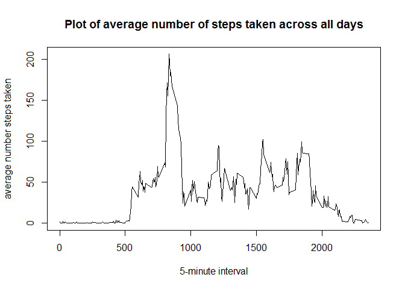

## Loading and preprocessing the data
1. Load the data

```r
fileURL <- "https://d396qusza40orc.cloudfront.net/repdata%2Fdata%2Factivity.zip"
download.file(fileURL, destfile="dataset.zip")
unzip("dataset.zip")
data <- read.csv("activity.csv", stringsAsFactors = FALSE)
```
2. View, process, and transform the data

```r
head(data)
```

```
##   steps       date interval
## 1    NA 2012-10-01        0
## 2    NA 2012-10-01        5
## 3    NA 2012-10-01       10
## 4    NA 2012-10-01       15
## 5    NA 2012-10-01       20
## 6    NA 2012-10-01       25
```

```r
str(data)
```

```
## 'data.frame':	17568 obs. of  3 variables:
##  $ steps   : int  NA NA NA NA NA NA NA NA NA NA ...
##  $ date    : chr  "2012-10-01" "2012-10-01" "2012-10-01" "2012-10-01" ...
##  $ interval: int  0 5 10 15 20 25 30 35 40 45 ...
```

```r
data$date <- as.Date(data$date)
```

## What is mean total number of steps taken per day?

1. Calculate the total number of steps taken per day.

```r
agg_steps <- tapply(X = data$steps, INDEX = data$date, FUN = sum, na.rm = TRUE)
```
2. Histogram of the total number of steps taken each day.

```r
hist(agg_steps, xlab = "Number of steps", main = "Total number of steps taken each day")
```

<!-- -->
  
3. Mean and median number of steps taken each day

```r
mean(agg_steps)
```

```
## [1] 9354.23
```

```r
median(agg_steps)
```

```
## [1] 10395
```

## What is the average daily activity pattern?

1. Time series plot of the 5-minute interval and the average number of steps taken, averaged across all days

```r
df_means <- aggregate(steps ~ interval, data = data, FUN = mean, na.rm=TRUE)

plot(x= df_means$interval, y = df_means$steps, type = 'l',
  xlab="5-minute interval", ylab="average number steps taken",
  main = "Plot of average number of steps taken across all days")
```

<!-- -->
  
2. Which 5-minute interval, on average across all the days in the dataset, contains the maximum number of steps?

```r
df_means[which.max(df_means$steps),'interval']
```

```
## [1] 835
```
Interval 835 contains the maximum number of steps.

## Imputing missing values

1. Calculate and report the total number of missing values in the dataset

```r
length(which(is.na(data$steps)))
```

```
## [1] 2304
```
There are 2304 missing values.

2. Devise a strategy for filling in all of the missing values in the dataset.  
The strategy I will use for filling in the missing values in the dataset is to use the mean for that particular 5-minute interval.

3. Create a new dataset that is equal to the original dataset but with the missing data filled in.  
  
Merge the 'data' dataframe with the 'df_means' dataset and call it 'newdata'.
This will show us the mean steps for each line item in the 'data' dataframe


```r
newdata <-merge(data, df_means, by.x="interval", by.y="interval")
head(newdata)
```

```
##   interval steps.x       date  steps.y
## 1        0      NA 2012-10-01 1.716981
## 2        0       0 2012-11-23 1.716981
## 3        0       0 2012-10-28 1.716981
## 4        0       0 2012-11-06 1.716981
## 5        0       0 2012-11-24 1.716981
## 6        0       0 2012-11-15 1.716981
```

```r
newdata <- newdata[order(newdata$date, newdata$interval),]
names(newdata) <- c("interval","steps","date","mean_steps")
```

Find out which rows and/or columns in 'newdata' are missing values.

```r
summary(newdata)
```

```
##     interval          steps             date              mean_steps     
##  Min.   :   0.0   Min.   :  0.00   Min.   :2012-10-01   Min.   :  0.000  
##  1st Qu.: 588.8   1st Qu.:  0.00   1st Qu.:2012-10-16   1st Qu.:  2.486  
##  Median :1177.5   Median :  0.00   Median :2012-10-31   Median : 34.113  
##  Mean   :1177.5   Mean   : 37.38   Mean   :2012-10-31   Mean   : 37.383  
##  3rd Qu.:1766.2   3rd Qu.: 12.00   3rd Qu.:2012-11-15   3rd Qu.: 52.835  
##  Max.   :2355.0   Max.   :806.00   Max.   :2012-11-30   Max.   :206.170  
##                   NA's   :2304
```
The na's are all in the column 'steps'.  
For those rows which are missing values, replace the missing values with mean number of steps for that same time interval.

```r
index <- which(is.na(newdata$steps))
newdata[index,"steps"] <- newdata[index,"mean_steps"]
newdata <- newdata[,c("steps","date","interval")]
head(newdata)
```

```
##         steps       date interval
## 1   1.7169811 2012-10-01        0
## 63  0.3396226 2012-10-01        5
## 128 0.1320755 2012-10-01       10
## 205 0.1509434 2012-10-01       15
## 264 0.0754717 2012-10-01       20
## 327 2.0943396 2012-10-01       25
```
4. Make a histogram of the total number of steps taken each day. Also calculate the mean and median 
total number of steps taken each day.

```r
new_agg_steps <- tapply(X = newdata$steps, INDEX = newdata$date, FUN = sum)
hist(new_agg_steps, xlab = "Number of steps", main = "Total number of steps taken each day")
```

<!-- -->

```r
mean(new_agg_steps)
```

```
## [1] 10766.19
```

```r
median(new_agg_steps)
```

```
## [1] 10766.19
```
  
The impact of imputing missing data (by using the 5-minute interval mean) increases the estimated mean and median of the total daily number of steps. This is due to the fact that the original data calculation ignored the NA values so that those dates with NAs ended up having zero steps.

## Are there differences in activity patterns between weekdays and weekends?

1. Create a new factor variable with two levels with two levels - "weekday" and "weekend."

```r
newdata$day <- ifelse(weekdays(newdata$date) %in% c('Saturday','Sunday'),'weekend','weekday')
newdata$day <- factor(newdata$day)
```

2. Make a panel plot containing a time series plot of the 5-minute interval and the average number of steps taken, averaged across all weekday days or weekend days.

```r
wk_means <- aggregate(steps ~ interval + day , data = newdata, FUN = mean)
head(wk_means)
```

```
##   interval     day      steps
## 1        0 weekday 2.25115304
## 2        5 weekday 0.44528302
## 3       10 weekday 0.17316562
## 4       15 weekday 0.19790356
## 5       20 weekday 0.09895178
## 6       25 weekday 1.59035639
```

```r
str(wk_means)
```

```
## 'data.frame':	576 obs. of  3 variables:
##  $ interval: int  0 5 10 15 20 25 30 35 40 45 ...
##  $ day     : Factor w/ 2 levels "weekday","weekend": 1 1 1 1 1 1 1 1 1 1 ...
##  $ steps   : num  2.251 0.445 0.173 0.198 0.099 ...
```

Order the data for the lattice plot

```r
wk_means <- wk_means[order(wk_means$interval),]
```

Create lattice plot

```r
library(lattice)
xyplot(steps ~ interval|day, data = wk_means,
       type='l', xlab="5-minute interval",
       ylab="average number steps taken",
       main = "Plot of average number of steps taken across all days")
```

<!-- -->
